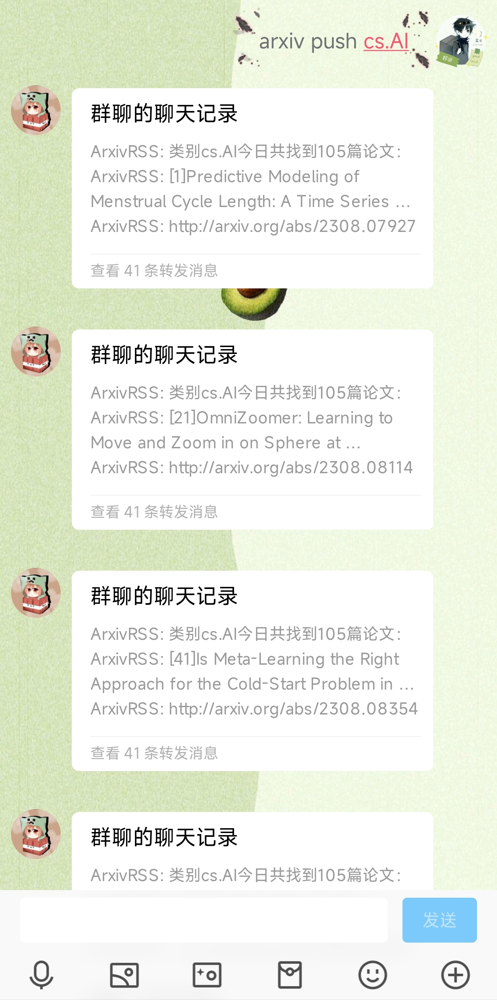
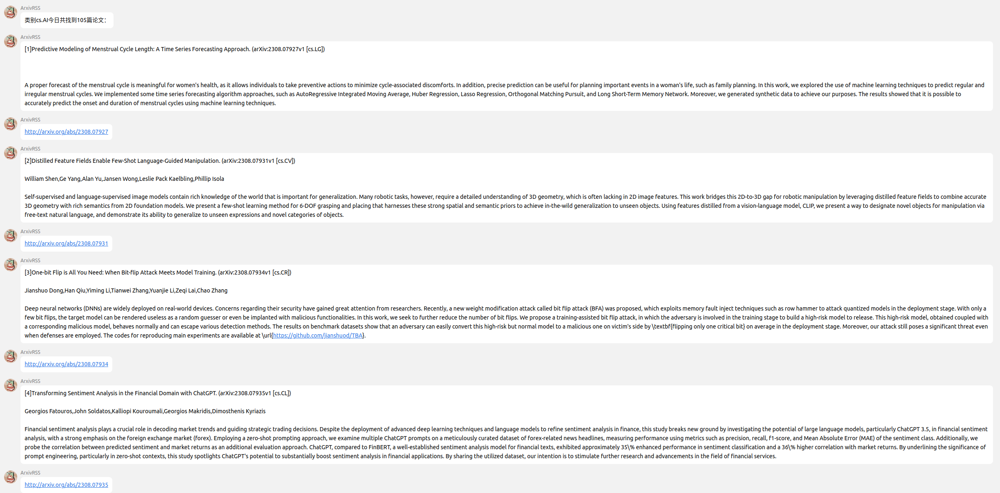

  
   
  

# nonebot-plugin-arxivRSS

_✨ 推送arxiv上每日最新论文的插件 ✨_

## 📖 介绍

这个插件调用arxiv的RSS订阅源，用于每天定时推送arxiv当天的新论文。目前仅支持私聊。

## 💿 安装

使用 nb-cli 安装

在 nonebot2 项目的根目录下打开命令行, 输入以下指令即可安装

    nb plugin install nonebot-plugin-arxivRSS

使用包管理器安装

在 nonebot2 项目的插件目录下, 打开命令行, 根据你使用的包管理器, 输入相应的安装命令

pip

    pip install nonebot-plugin-arxivRSS

pdm

    pdm add nonebot-plugin-arxivRSS

poetry

    poetry add nonebot-plugin-arxivRSS

conda

    conda install nonebot-plugin-arxivRSS

打开 nonebot2 项目根目录下的 `pyproject.toml` 文件, 在 `[tool.nonebot]` 部分追加写入

    plugins = ["nonebot_plugin_arxivRSS"]

## 🎉 使用

⚠️**目前仅支持私聊**⚠️

首先使用`arxiv set <hh> <mm>`设定每日推送时间。

然后使用`arxiv add <category>`添加您关注的领域。`<category>`是arxiv官方对论文领域的分类，例如`cs`代表Computer Science，`cs.CL`代表Computation and Language。**`<category>`可以是单独的领域，也可以是多个领域，领域间使用空格分开。**[此处](https://arxiv.org/category_taxonomy)可以查看所有领域。

此时您已经完成了基本的设置，您将会在每日`<hh>:<mm>`收到来自arxivRSS的当日推送。

您还可以通过`arxiv push [category]`指令立刻获取arxivRSS的当日推送。如果不提供`[category]`，则推送您订阅中的所有领域。

**新增功能**

新增了关键词功能，会从标题、作者、摘要中匹配关键字，如果包含关键字，相关论文的编号会在最后给出。

您可以通过`arxiv kw`查看对应关键字的增删改指令。

### 所有指令

`arxiv` 显示所有指令

`arxiv add <category>` 添加`<category>`至您的订阅。

`arxiv del <category>` 从您的订阅中删除`<category>`。

`arxiv set <hh> <mm>` 设定您的推送时间为hh:mm，注意是空格不是:。

`arxiv cancel` 取消订阅。

`arxiv show` 查看您的订阅类别和推送时间。

`arxiv list` 查看所有可用的领域。

`arxiv push [category]` 立即获取`[category]`中所有类别的当日推送。如果`[category]`没有指定，那么会尝试推送您订阅中的所有领域。

`arxiv kw` 查看有关关键字的指令

`arxiv kw add <keyword>` 添加一个关键字。注意，一次只能添加一个关键字，可以包含空格。

`arxiv kw show` 查看所有关键字

`arxiv kw del <keyword>` 删除一个关键字。注意，一次只能删除一个关键字，可以包含空格。

`arxiv kw cancel` 删除所有关键字。注意，此操作不可逆。

### 已知的问题

由于Arxiv官方的更新时间是GMT的每日0点之后，因此在北京时间的每日0点-8点，获取的仍然是前一天的内容；北京时间的每日8点之后，会存在一段时间的空白期，无法获取任何论文内容。

解决这一问题的办法为，使用国内的镜像源。

这一方法的缺点在于，获取的论文链接域名为`cn.arxiv.org`，无法访问。当然了，只需要去掉前缀`cn.`就可以正常访问了，但是会多一个步骤。

- [x] 已更新自动切换国内源和对国内链接的处理

### 效果图

